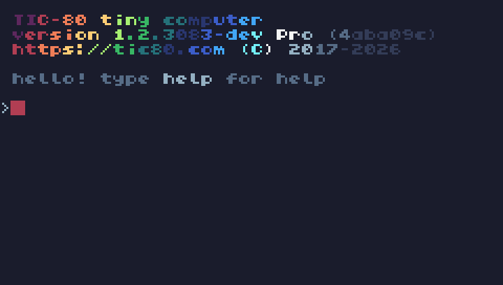
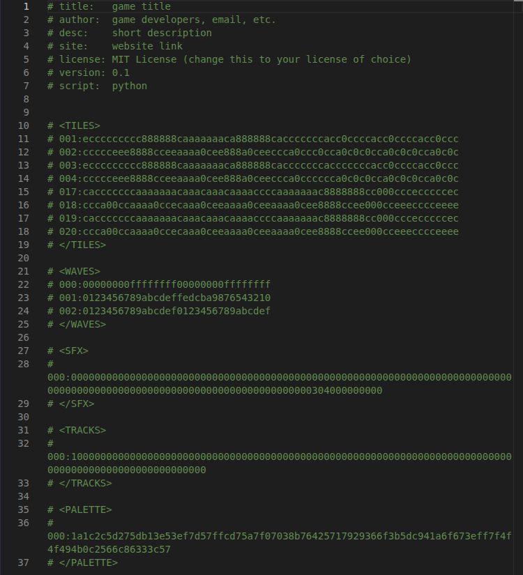

# Prise en main de TIC-80

TIC-80 est une fantasy retro console open source conçu pour créer, jouer et partager de petits jeux. Prenez quelques instants pour la découvrir en testant un jeu : [https://tic80.com/play](https://tic80.com/play)

## Prendre en main l'environnement

### Lance l'environnement
<!-- ws:doit -->

**Ton objectif :** 
- Ouvre l'environement TIC-80 en cliquant sur le bouton **Ouvrir TIC-80** qui se trouve en bas à droite de ton écran.
  <!-- ws:cue runtime -->
- Clique ensuite dans le panneau **TIC-80** sur "Click to play" pour démarrer ton environnement.



## Initialiser TIC-80 pour pouvoir utiliser le langage Python

Il te suffit de taper la commande suivante dans le panneau **TIC-80**:

```bash
new python
```

<!-- ws:toolbox -->
### Boîte à outils

> 🧰 **Outil #1 : `new python` « Initiliser un projet en Python dans TIC-80 »**
> Taper `new python` dans la console permet d'indiquer que tu souhaite faire ton projet en Python. TIC-80 est capable d'utiliser d'autres languages de programmation comme Lua ou JavaScript.

<!-- /ws:toolbox -->

## Reset “hello world”

Le plus simple pour bien comprendre le fonctionnement de TIC-80 consiste de partir d’un environnement vierge, nous allons donc supprimer tous les éléments de la démo.

### Mise en application
<!-- ws:doit -->

- Après avoir initilisé ton projet en Python, rends-toi dans le panneau **Editor** et supprime tout le code entre la ligne `9` et la ligne `32` incluse.



<!-- ws: {type: quiz, id: init-cmd, kind: single, points: 10} -->
> Quelle commande initialise un projet Python dans TIC-80 ?

- A. init python
- B. new python
- C. start python

## Affichage du pad et de l’écran de jeu

Tu va taper tes premières lignes de code dans TIC-80: 

```python
def TIC():
 cls()
 rect(0,0,120,120,10)
 rect(45, 110, 30, 3, 12)
```

<!-- ws:toolbox -->
### Boîte à outils

> 🧰 **Outil #1 : `cls()` « efface l'écran »**
> Moyen mnémotechnique: **CL**ear **S**creen
> 🧰 **Outil #2 : `rect()` « dessine un rectangle sur l'écran »**
> Les valeurs entre les parenthèses permettent de préciser la position, les dimensions et la couleur du rectangle

<!-- /ws:toolbox -->


### Mise en application
<!-- ws:doit -->

Écrit le code initial dans l'éditeur:
```python
def TIC():
 cls()
 rect(0,0,120,120,10)
 rect(45, 110, 30, 3, 12)
```

<details>
    <summary>Explications</summary>
- La partie principale du programme se déclare de la façon suivante `def TIC():`
- Le code en dessous de la partie principale du programme doit respecter une indentation propre au python : il faut un espace au début de chaque ligne comme le code ci-dessus.
- Les instructions en dessous de `def TIC():` s'éxecutent dans l'ordre: éffacer l'écran, dessine un rectangle, dessine un autre rectangle

</details>

Pour lancer ton code: 
- Clique dans le panneau TIC-80
- Tape la commande `run` **ou** utlise `Ctrl`+`Entrée`


<!-- ws: {type: quiz, id: cls-role, kind: single, points: 10} -->
> À quoi sert la fonction `cls()` dans notre programme TIC-80 ?

- A. À calculer le score du joueur
- B. À dessiner un rectangle
- C. À effacer l'écran
- D. À lancer le programme

<!-- ws: {type: quiz, id: tic-rect, kind: single, points: 10} -->
> Que fait la fonction `rect()` ?
- A. Dessine un cercle
- B. Dessine un triangle
- C. Dessine un rectangle
- D. Cette fonction ne fait rien

<!-- ws: {type: quiz, id: rect-order, kind: single, points: 10} -->
> Que se passe-t-il si les lignes `rect(0, 0, 120, 120, 10)` et `rect(45, 110, 30, 3, 12)` étaient inversées ?
- A. Les rectangle sont dessiné dans un ordre différent, le rectangle bleu est dessiné après le rectangle blanc, le rectangle blanc n'est plus visible
- B. Le programme se comporte exactement comme avant, rien n'a changé
- C. Le programme plante et une erreur s'affiche
- D. Des cercles s'affichent à l'écran à la place des rectangles
