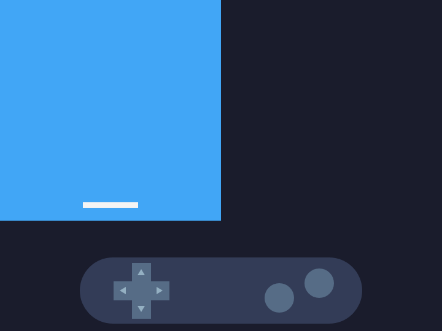
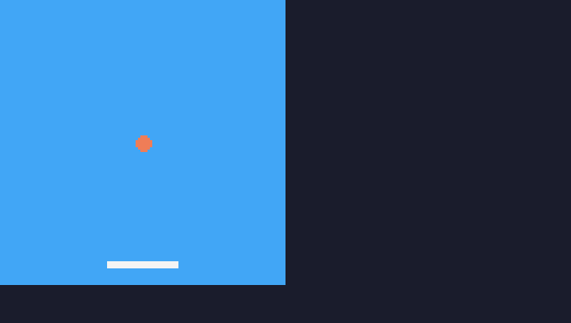
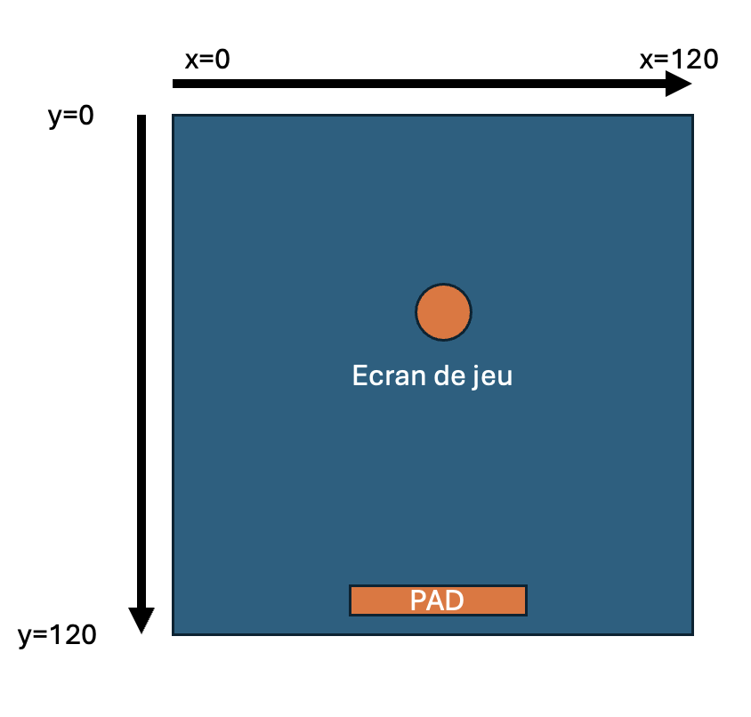
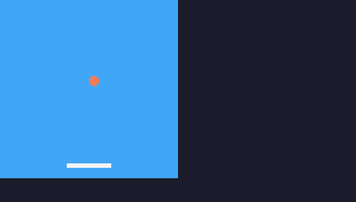
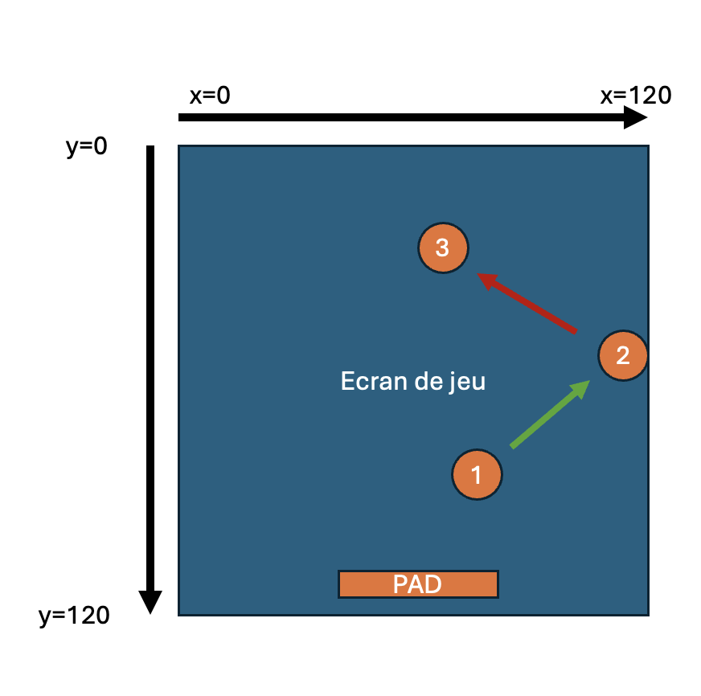
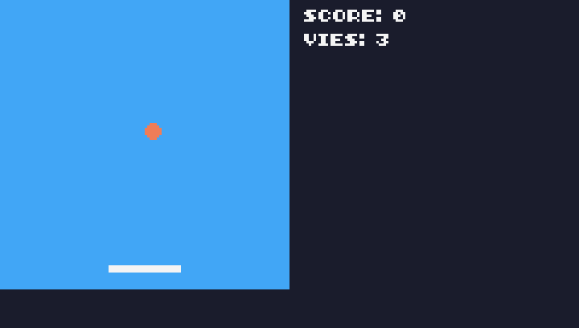
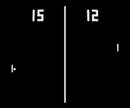

# Créer ton mini-jeu

Tu es prêt à créer ton premier mini-jeu.

## Prise en main de TIC-80
<!-- ws: {type: chapter, topology: linear} -->

### Prendre en main l'environnement
<!-- ws: {type: exercise, id: prise-en-main, validation: quiz} -->

#### Lance l'environnement
<!-- ws:doit -->

**Ton objectif :**
- Ouvre l'environnement TIC-80 en cliquant sur le bouton **Ouvrir TIC-80** qui se trouve en bas à droite de ton écran.
  <!-- ws:cue runtime -->
- Clique ensuite dans le panneau **TIC-80** sur « Click to play » pour démarrer ton environnement.


#### Initialiser TIC-80 pour pouvoir utiliser le langage Python

Il te suffit de taper la commande suivante dans le panneau **TIC-80** :

```bash
new python
```

<!-- ws:toolbox -->
> 🧰 **Outil #1 : `new python` « Initialiser un projet en Python dans TIC-80 »**
> Taper `new python` dans la console permet d'indiquer que tu souhaites faire ton projet en Python. TIC-80 est capable d'utiliser d'autres langages de programmation, comme Lua ou JavaScript.
<!-- /ws:toolbox -->

#### Reset “hello world”

Le plus simple pour bien comprendre le fonctionnement de TIC-80 consiste à partir d’un environnement vierge : tu vas donc supprimer tous les éléments de la démo.

##### Mise en application
<!-- ws:doit -->

- Après avoir initialisé ton projet en Python, rends-toi dans le panneau **Editor** et supprime tout le code **après** `# script:  python`.


<!-- ws: {type: quiz, id: init-cmd, title: "Créer un projet Python", kind: single, points: 10} -->
> Quelle commande initialise un projet Python dans TIC-80 ?

- A. init python
- B. new python
- C. start python

### Affichage du pad et de l’écran de jeu
<!-- ws: {type: exercise, id: affichage-pad, validation: quiz} -->

Ici tu vas taper tes premières lignes de code dans TIC-80.


<!-- ws:toolbox -->
> 🧰 **Outil #2 : `cls()` « efface l'écran »**
> Moyen mnémotechnique : **CL**ear **S**creen

> 🧰 **Outil #3 : `rect()` « dessine un rectangle sur l'écran »**
> Les valeurs entre les parenthèses permettent de préciser la position, les dimensions et la couleur du rectangle
<!-- /ws:toolbox -->


#### Mise en application
<!-- ws:doit -->

Écris le code initial dans l'éditeur :
```python
def TIC():
 cls()
 rect(0,0,120,120,10)
 rect(45, 110, 30, 3, 12)
```

<details>
    <summary>Explications</summary>

- La partie principale du programme se déclare de la façon suivante `def TIC():`

- Le code en dessous de la partie principale du programme doit respecter une indentation propre à Python : il faut un espace au début de chaque ligne comme le code ci-dessus.

- Les instructions en dessous de `def TIC():` s'exécutent dans l'ordre : effacer l'écran, dessiner un rectangle, dessiner un autre rectangle

</details>

Pour lancer ton code :
- Clique dans le panneau TIC-80
- Tape la commande `run` **ou** utilise `Ctrl`+`Entrée`


<!-- ws: {type: quiz, id: cls-role, title: "Le rôle de cls()", kind: single, points: 10} -->
> À quoi sert la fonction `cls()` dans notre programme TIC-80 ?

- A. À calculer le score du joueur
- B. À dessiner un rectangle
- C. À effacer l'écran
- D. À lancer le programme

<!-- ws: {type: quiz, id: tic-rect, title: "La fonction rect()", kind: single, points: 10} -->
> Que fait la fonction `rect()` ?
- A. Dessine un cercle
- B. Dessine un triangle
- C. Dessine un rectangle
- D. Cette fonction ne fait rien

<!-- ws: {type: quiz, id: rect-order, title: "L'ordre des rectangles", kind: single, points: 10} -->
> Que se passerait-il si les lignes `rect(0, 0, 120, 120, 10)` et `rect(45, 110, 30, 3, 12)` étaient inversées ?
- A. Les rectangles sont dessinés dans un ordre différent : le rectangle bleu est dessiné après le rectangle blanc, qui n'est plus visible
- B. Le programme se comporte exactement comme avant, rien n'a changé
- C. Le programme plante et une erreur s'affiche
- D. Des cercles s'affichent à l'écran à la place des rectangles

## Construire le jeu
<!-- ws: {type: chapter, topology: linear} -->

### Faire bouger le pad
<!-- ws: {type: exercise, id: pad-mouvement} -->

Pour faire bouger le pad avec le clavier, il faut :

- déclarer une variable `padx`, qui permet de modifier la position du pad sur l’axe des abscisses
- utiliser une condition `if` pour modifier la valeur de `padx` lorsque l’on appuie sur la touche **`←`** du clavier

<!-- ws:toolbox -->
> 🧰 **Outil #4 : Variable**
> Une variable permet de représenter une valeur qui va changer lors de l'exécution d'un programme.
> `padx` va représenter la position de notre pad sur l'axe des abscisses, cette position peut être modifiée (sinon le pad ne pourrait pas bouger)
> Le `=` permet de donner une valeur à une variable

> 🧰 **Outil #5 : Condition**
> `if` permet d'exécuter du code seulement si une condition est remplie
> Ici, la condition est : « si le joueur appuie sur la touche **`←`** »
> Le code à exécuter si elle est remplie : « alors modifie la valeur de `padx` »
<!-- /ws:toolbox -->


Retourne dans l’éditeur pour modifier le code.

```python
# script:  python
padx=45
padw=30
padh=3

def TIC():
 global padx

 if btn(2):
  padx = padx - 2
 cls()
 rect(0,0,120,120,10)
 rect(padx, 110, padw, padh, 12)
```

Teste en cliquant dans le panneau TIC-80, le raccourci **`Ctrl`+`Entrée`** relance le jeu avec ton code modifié :
- La touche **`←`** doit déplacer le pad vers la gauche.

#### Fais bouger le pad dans l’autre direction
<!-- ws:doit -->

Après avoir testé le code précédent, inspire-toi de celui-ci pour faire en sorte que le pad puisse bouger à droite comme à gauche.




<!-- ws: {type: hint} -->
<details><summary>Indice</summary>

La fonction **`btn`** prend en paramètre un nombre (3 : flèche droite du clavier). Une page de l’aide contient le tableau de correspondance avec les touches du clavier : [https://github.com/nesbox/TIC-80/wiki/key-map](https://github.com/nesbox/TIC-80/wiki/key-map)

</details>

<!-- ws: {type: quiz, id: btn-doc, title: "Les touches du joueur", kind: multiple, points: 10} -->
> Avec TIC-80, si je souhaite avoir l'état des touches haut et bas du joueur 1, je dois utiliser dans mon code (2 réponses correctes)

* A. btn(0)
* B. btn(1)
* C. btn("up")
* D. btn("down")


#### Limite les mouvements du pad

<!-- ws:toolbox -->
> 🧰 **Outil #6 : Opérateur logique `and`**
> Un bloc `if condition1 and condition2:` n'exécute son code que si `condition1` et `condition2` sont remplies
> Exemple :
> ```python
> if ilPleut and jeSuisDehors:
>  ouvreUnParapluie
> ```
<!-- /ws:toolbox -->

Améliore la gestion des mouvements du pad pour qu'il reste dans le carré de jeu.


### Créer la balle rebondissante
<!-- ws: {type: exercise, id: balle-mouvement, validation: quiz} -->

<!-- ws:toolbox -->
> 🧰 **Outil #7 : La fonction `circ()`**
> Consulte l'aide de TIC-80 [https://tic80.com/learn](https://tic80.com/learn) et retrouve tous les paramètres de la fonction `circ`
<!-- /ws:toolbox -->

#### Dessiner la balle
<!-- ws:doit -->

Utilise la fonction `circ` pour créer la balle au centre de l’écran. Pense à utiliser des variables `ballx` et `bally` pour pouvoir déplacer ta balle dans l’écran de jeu.



#### Faire bouger la balle


<!-- ws:toolbox -->
> 🧰 **Outil #8 : Vecteur vitesse**
> La fonction `TIC()` est lancée 60 fois par seconde.
> Pour faire bouger la balle à l'écran à une certaine vitesse, tu dois ajouter à la position de la balle `ballx` et `bally` une vitesse `ballspeedx` et `ballspeedy` à chaque fois que la fonction TIC() est lancée.
> Une vitesse nulle rend la balle immobile.
<!-- /ws:toolbox -->

Pour faire bouger la balle, tu vas modifier les coordonnées du centre : `ballx` et `bally`.



Pour obtenir une trajectoire en diagonale (comme sur un billard), il faut modifier à chaque fois `ballx` et `bally`.

Tout d’abord, essaye de faire bouger la balle en diagonale vers le haut et vers la droite, en utilisant deux nouvelles variables `ballspeedx` et `ballspeedy`.



<!-- ws: {type: quiz, id: balle-direction, title: "La direction de la balle", kind: single, points: 10} -->
> Pour que la balle parte en diagonale vers le haut et vers la droite, quelles valeurs faut-il donner à `ballspeedx` et `ballspeedy` ?

- A. `ballspeedx = 1` et `ballspeedy = 1`
- B. `ballspeedx = 1` et `ballspeedy = -1`
- C. `ballspeedx = -1` et `ballspeedy = 1`
- D. `ballspeedx = -1` et `ballspeedy = -1`

<!-- ws: {type: quiz, id: balle-vitesse, title: "La vitesse de la balle", kind: single, points: 10} -->
> La fonction `TIC()` est lancée 60 fois par seconde. Si `ballspeedx` vaut `2`, de combien de pixels la balle se déplace-t-elle vers la droite en une seconde ?

- A. 2
- B. 60
- C. 120
- D. 240

### Faire rebondir la balle
<!-- ws: {type: exercise, id: balle-rebond} -->

Pour faire rebondir la balle, tu dois inverser la direction de la balle en fonction de sa position à l’écran.

Si la balle atteint la limite de la zone de jeu, on simule une collision en inversant sa vitesse sur l’axe où a lieu la collision.



La balle est en position 1 et se dirige vers la position 2 en suivant la trajectoire verte : dans ce cas, `ballspeedx = 2`.

Une fois arrivée à la bordure de la zone de jeu, sur le schéma à la position `x=120`, on inverse la vitesse de la balle : `ballspeedx = -2`.

Il faut penser à prendre en compte le rayon de la balle.

#### Les 3 cas à gérer
<!-- ws:doit -->

Tu as 3 cas à gérer : la balle doit rebondir quand elle touche
- la bordure du haut
- la bordure de droite
- la bordure de gauche


<!-- ws: {type: quiz, id: rebond, title: "Le sens du rebond", kind: match, points: 10} -->
> Fais correspondre la vitesse initiale de la balle sur un axe avec sa nouvelle vitesse sur ce même axe, pour qu'elle reparte dans l'autre sens.

- A. 0
- B. 2
- C. -5
- a. 5
- b. 0
- c. -2

### Checkpoint
<!-- ws: {type: exercise, id: checkpoint} -->

Vérifie le comportement de ton programme :
- Les flèches gauche et droite de ton clavier font bouger le pad dans les deux directions
- La balle commence au centre de l'écran, elle se déplace toute seule et rebondit lorsqu'elle rencontre un bord de l'écran


### Gérer le respawn et la collision avec le pad
<!-- ws: {type: exercise, id: respawn} -->

#### Respawn
<!-- ws:doit -->

Lorsque la balle dépasse la limite de la bordure du bas de l’espace de jeu, elle continue à descendre pour ensuite disparaître.

Tu vas devoir faire en sorte que la balle « respawn » à son point de départ dès qu'elle sort de l’espace de jeu par le bas.


#### Gérer la collision avec le pad

Lorsque la balle se retrouve en collision avec le pad, tu vas devoir faire en sorte que la balle rebondisse sur le pad. Cette étape est importante : c’est à partir de ce moment-là que ton jeu sera vraiment jouable.


<!-- ws: {type: hint} -->
<details><summary>Indice</summary>

Utilise une triple condition avec les variables `ballx`, `bally`, `padx`, `pady` et `padw` pour gérer la collision.

</details>

### Ajouter une interface
<!-- ws: {type: exercise, id: interface} -->

#### Le score
<!-- ws:doit -->

Avec la fonction `print` et la fonction `str`, tu vas afficher le score à l’écran. La méthode de calcul est simple : plus 10 points à chaque fois que la balle rebondit sur le pad.

Positionne la fonction `print` à la fin de ta fonction `TIC()` pour que le score s’affiche au-dessus de tous les autres éléments.

Crée une nouvelle variable `score` que tu vas incrémenter dans la condition qui permet de faire rebondir la balle.


#### Vies et game over

De la même manière que dans l’exercice précédent, crée un système de vies : 3 vies, affichées dans l’interface en dessous du score. Lorsque le nombre de vies est égal à zéro, replace la balle à son point de départ, fais en sorte qu'elle ne bouge plus et affiche « game over » au centre de l’écran.



### Pour aller plus loin

Tu peux ajouter de nouvelles fonctionnalités à ton jeu, comme un écran de « high scores » qui s’affiche lors du game over, comme dans les jeux rétro, et une option pour relancer le jeu et tenter de battre ces high scores.

Tu peux aussi créer un nouveau jeu en t'appuyant sur tout ce que tu as appris dans ce coding club, comme le célèbre PONG à deux joueurs, et pourquoi pas une IA pour jouer contre toi.



### Crédits

Cet atelier a été écrit et testé à Epitech Montpellier 💙 pour le Coding Club

Merci à PICO-8 Fanzine #1 pour l’inspiration, grâce à ses tutos de création de jeux sur PICO-8 (la grande sœur de TIC-80).
